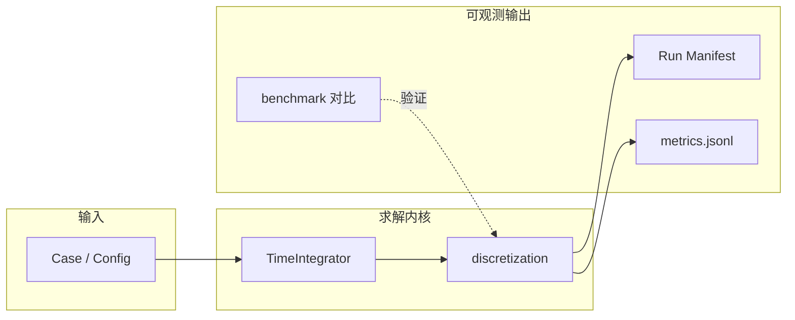
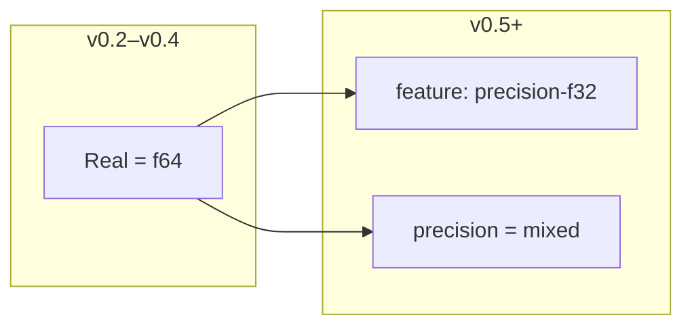
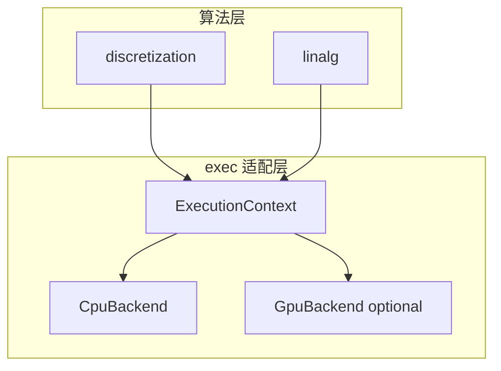

# asimu 架构设计文档

> 版本：v0.1 设计基线 · 最后更新：2026-06-08
> 英文摘要：[en/ARCHITECTURE.md](en/ARCHITECTURE.md) · 数据模型：[DATA_MODEL.md](DATA_MODEL.md)

---

## 1. 概述

### 1.1 一句话定位

**asimu** 是面向开发者与研究人员的 Rust 计算流体力学（CFD）求解器：模块化、可测试、可复现，CLI 优先。

### 1.2 问题域

CFD 程序的核心工作流固定且重复：

```
读算例 → 建网格 → 初始化物理场 → 离散装配 → 线性/非线性求解 → 时间推进 → 输出
```

架构设计的目标，是让上述每个阶段对应**独立模块**，依赖单向、边界清晰，便于：

- 分版本迭代（先 1D 对流-扩散，再 2D NS）
- 数值回归测试（离散格式可单测）
- Agent 与多人协作（模块职责不含糊）

### 1.3 当前实现状态

| 模块 | 状态 | 说明 |
|------|------|------|
| `core` | 已实现 | `Real`、`Vector3`、容差工具 |
| `mesh` | 已实现 | 结构化 2D/3D、非结构混合单元、`UnstructuredSolverMeshCache` |
| `field` | 已实现 | SoA 标量/矢量/守恒/原始变量场 |
| `discretization` | 已实现（演进中） | 扩散、可压 Euler/NS、非结构 FVM、BC；见 §8.7 feature 矩阵 |
| `physics` | 部分 | 理想气体、粘性配置 |
| `linalg` | 部分 | 稀疏系统、CG；可压 GMRES |
| `exec` | **部分** | `cpu/` SIMD 热算子（`simd-fvm`）；`ExecutionContext` 见 [ADR 0013](adr/0013-exec-parallel-scatter-execution-context.md) |
| `solver` | 已实现（演进中） | Euler/RK4/LU-SGS、非结构 LU-SGS sweep |
| `case` / `app` | 已实现 | CLI 算例编排 |
| `io` | 部分 | case TOML、VTS/VTU、CGNS（feature 门控） |
| `config` | 已实现 | TOML + CLI + 环境变量 |
| `error` | 已实现 | 统一错误类型 |
| `mcp` | 规划 | v1.1+ |

### 1.4 横向能力（规划索引）

与分层模块正交的 **跨-cutting 能力**：

| 能力 | 文档 | 首版 | 状态 |
|------|------|------|------|
| **Run Manifest** | [DATA_MODEL.md](DATA_MODEL.md) §10 · §8.5.1 | v0.3 | 规划 |
| **时间推进抽象** | [adr/0005](adr/0005-time-integration.md) · §8.5.4 | v0.2 `SteadyState` | 规划 |
| **标准验证算例库** | [BENCHMARKS.md](BENCHMARKS.md) · §8.5.6 | v0.2 1D | 规划 |
| **性能与可观测性** | [OBSERVABILITY.md](OBSERVABILITY.md) · §8.6 | v0.3 基础 timing | 规划 |
| Checkpoint / Restart | DATA_MODEL §11 · §8.5.2 | v0.4 | 规划 |
| Study 参数扫描 | §8.5.5 | v0.5 | 规划 |

---

## 2. 目标与非目标

### 2.1 目标

- **分层清晰**：数据（mesh/field）与算法（discretization/physics/linalg）分离，`solver` 只做编排
- **可测试**：离散算子、线性求解器可独立于完整求解流程单测
- **可演进**：v0.1 单 crate 模块化，规模增大后可拆 workspace
- **工程一致**：统一错误、日志、配置；CI / pre-commit 与本地命令对齐
- **可复现构建**：提交 `Cargo.lock`，锁定工具链
- **精度可扩展**：v0.2 起用 `Real` 类型别名，为 `f32` / 混合精度预留（见 §8.4）
- **执行后端可插拔**：CPU 为默认路径，GPU 经 `exec` 层可选接入（见 §8.4）
- **运行可复现**：Run Manifest 记录版本、配置与结果摘要（见 §8.5.1）
- **时间推进可扩展**：稳态/瞬态经 `TimeIntegrator` 统一抽象（见 §8.5.4、ADR 0005）
- **物理可验证**：标准 V&V 算例库与 golden test 分工（见 §8.5.6、[BENCHMARKS.md](BENCHMARKS.md)）
- **性能可观测**：日志、metrics、benchmark 与 manifest 联动（见 §8.6、[OBSERVABILITY.md](OBSERVABILITY.md)）

### 2.2 非目标（当前阶段）

- 完整三维可压 Navier-Stokes **生产级**求解（架构基线见 [adr/0009](adr/0009-compressible-navier-stokes.md)，首版目标 v1.x）
- GUI、云服务、Web 前端
- 分布式 MPI 并行（远期单独 ADR）
- 与 CFL3D 等 Fortran 遗留代码的二进制兼容
- 第一版即支持 CGNS / OpenFOAM 网格（I/O 适配层预留，实现靠后）
- v0.4 之前交付 GPU 生产路径（仅架构预留与 CPU 验证）
- v0.5 之前交付混合精度生产路径

---

## 3. 设计原则

| 原则 | 含义 |
|------|------|
| **数据流单向** | 上层编排下层，下层不知道 `solver` 的存在 |
| **热路径具体化** | 面循环、矩阵装配用具体类型 + SoA；trait 用于扩展点，不包裹整个内层循环 |
| **编排与算法分离** | 通量格式、梯度重构不属于 `solver` |
| **I/O 不渗透数值** | `io` 只产出数据结构，不在解析阶段做离散假设 |
| **先正确后并行** | v0.x 单线程验证数值；v1.x 再 `rayon` 面循环并行 |
| **复杂度可控** | 单文件 ≤800 行、函数 ≤150 行（见 §13） |
| **显式状态** | 影响数值结果的数据必须在参数/返回值中可见；禁止隐式全局或模块级可变状态（见 [AGENTS.md](../AGENTS.md) §编程风格约束） |
| **边界校验** | io/mesh/field 构造时校验；discretization/linalg 热路径信任已验证输入 |
| **可测试** | 离散算子小网格可测；数值变更同步 golden test |
| **精度与后端前瞻** | 数值类型用 `Real`；热点经 `exec` 调度，不在离散公式内硬编码 CPU/GPU |

---

## 4. 求解流水线

### 4.1 逻辑流程


### 4.2 应用层与库 API 边界

| 层级 | 模块 | 用途 | semver |
|------|------|------|--------|
| **CLI** | `main.rs` | 解析参数、退出码 | — |
| **MCP** | `asimu-mcp`（v1.1+ 规划） | Agent/IDE 协议适配 | 较宽松 |
| **应用编排** | `app`（→ v0.3 `case`） | `app::run(Cli)`、日志、算例驱动 | 较宽松 |
| **库 API** | `prelude`, `mesh`, `solver`, … | 供外部 crate 集成的数值能力 | 严格 |

`Case`（规划中的 `src/case.rs`）将自 **`app`** 演进，负责：

1. 根据配置选择求解器类型（如 `SteadyDiffusion`、`IncompressibleNavierStokes`）
2. 串联 `io → mesh + field → solver → io`
3. 汇总日志与退出码

`main.rs` 只做参数解析与 `app::run()`（未来 `case::execute()`）调用；**库用户**直接使用 `mesh` / `solver` 等模块，见 [API.md](API.md)。

**不需要**单独的 `src/api/` 目录：库公开面由 `lib.rs` + `pub mod` / `prelude` 定义；`docs/API.md` 为人类契约文档。

### 4.3 四大横向能力（规划总览）

以下能力与 §1.4 索引对应，实现节奏独立于单模块交付：



| # | 能力 | 一句话 | 专文 |
|---|------|--------|------|
| 1 | **Run Manifest** | 每次运行写入可复现元数据 JSON | §8.5.1 |
| 2 | **时间推进抽象** | `TimeIntegrator` 统一稳态/瞬态 | §8.5.4 · ADR 0005 |
| 3 | **标准验证算例库** | 文献/解析解 V&V，非 golden 回归 | §8.5.6 · [BENCHMARKS.md](BENCHMARKS.md) |
| 4 | **性能与可观测性** | tracing + metrics + criterion | §8.6 · [OBSERVABILITY.md](OBSERVABILITY.md) |

---

### 4.4 MCP 适配层（规划）

> 详见 [MCP.md](MCP.md)、[adr/0004-mcp-integration.md](adr/0004-mcp-integration.md)。

**MCP（Model Context Protocol）** 与 CLI 并列，面向 Cursor 等 AI 客户端：

```
AI Client → MCP (stdio) → asimu-mcp → app/case → 库 API
```

| 原则 | 说明 |
|------|------|
| 适配非核心 | MCP handler 只调 `app`/`case` 与库模块，不实现数值算法 |
| 独立 binary | `asimu-mcp`，默认构建不包含 |
| 安全沙箱 | 路径限制、无 shell Tool、不暴露 `.env` |
| 晚于 v1.0 | 库 API 稳定后再实现，避免协议与内核同步频繁 breaking |

首批 Tool（v1.1）：`validate_config`、`run_case`、`list_fixtures`、`get_run_summary`。
首批 Resource：架构/API/AGENTS 文档与 fixture 只读 URI。

---

## 5. 分层架构

### 5.1 架构总图

```
┌──────────────────────────────────────────────────────────┐
│  CLI (main.rs)  ·  MCP (asimu-mcp, v1.1+)               │
├──────────────────────────────────────────────────────────┤
│  Application — app / case 编排                            │
├────────┬─────────┬──────────────┬─────────┬──────────────┤
│ config │   io    │    solver    │  case   │  (future)    │
├────────┴────┬────┴──────┬───────┴─────────┴──────────────┤
│             │           │                                 │
│   mesh ← field ← discretization                          │
│             │           │                                 │
│   physics ──┤           ├── linalg                         │
│             │           │                                 │
│             └───── exec（CPU / GPU 后端，v1.2+）──────────┤
│             │           │                                 │
├─────────────┴───────────┴─────────────────────────────────┤
│  core — 数学类型、常量、收敛判据、小型工具函数              │
├──────────────────────────────────────────────────────────┤
│  error — AsimuError                                      │
└──────────────────────────────────────────────────────────┘
```

### 5.2 分层说明

| 层级 | 模块 | 职责摘要 |
|------|------|----------|
| 应用层 | `main`, `app`, `case`（规划） | CLI、算例编排 |
| 领域层 | `mesh`, `field`, … | CFD 核心数值逻辑（**库 API**） |
| 适配层 | `io`, `config`, `mcp`（规划） | 文件格式、参数、Agent 协议 |
| 基础层 | `core`, `error` | 与问题无关的共用能力 |

---

## 6. 模块职责

| 模块 | 负责 | 不负责 |
|------|------|--------|
| **core** | 向量/张量、物理常量、`norm`、`approx_eq` 等数值工具 | 网格拓扑、方程离散 |
| **mesh** | 节点/单元/面拓扑，几何量（体积、法向、中心） | 时间推进、线性求解 |
| **field** | 按 mesh 存储 DOF（`u,v,p,T,…`），SoA 布局 | 通量计算、湍流模型 |
| **discretization** | 梯度、对流/扩散通量、限制器、残差与 Jacobian 装配 | 状态方程、湍流源项 |
| **physics** | 状态方程、粘性系数、源项、湍流/多相本构 | 网格读写、矩阵求解 |
| **linalg** | 稀疏矩阵存储、预条件、迭代求解器（CG/GMRES 等） | 物理含义、网格遍历、设备驱动 |
| **exec** | 执行上下文：CPU/GPU 场 buffer、kernel 调度、设备间拷贝 | 离散公式、BC 语义 |
| **solver** | 时间步进、SIMPLE/PISO/投影法、非线性迭代、收敛监控 | 具体通量公式、GPU kernel 实现 |
| **io** | case/VTK/CGNS 适配；产出 `Mesh` + `Field` + BC 描述 | 求解算法 |
| **mcp** | MCP tools/resources；调用 `app`/`case` 与库 API | 数值算法、直接读 `.env` |
| **config** | 参数加载、校验、优先级合并 | 数值计算 |
| **app** | CLI 算例驱动（`run(Cli)`） | 离散公式、稳定库 API 定义 |
| **case** | 通用算例编排（由 `app` 演进） | 同上 |
| **error** | 统一错误枚举与 `Result` 别名 | — |

详细数据结构见 [DATA_MODEL.md](DATA_MODEL.md)。

---

## 7. 依赖规则

### 7.1 允许依赖（箭头指向被依赖方）

```
core ← mesh ← field ← discretization
core ← physics
core ← linalg
core ← exec
core ← io

mesh + field + discretization + physics + linalg ← solver
discretization + linalg → exec（执行后端，仅热算子）
mesh + field ← io

config → 各层只读引用（不依赖 solver / discretization 实现）
case → io, solver, config, mesh, field（编排层）
app → io, solver, config, mesh, field（v0.1 已实现，CLI 编排）
mcp → app, case, io, config（v1.1+ 规划；仅适配层）
lib / main → app, config, error
```

### 7.2 禁止依赖

| 禁止 | 原因 |
|------|------|
| `core` → 任何领域模块 | 保持基础层纯净 |
| `mesh` → `solver` / `discretization` | 网格是数据，不是算法 |
| `io` → `solver` / `discretization` | 解析与求解解耦 |
| `discretization` → `solver` | 离散是底层算子 |
| `linalg` → `mesh` / `field` | 线性代数与物理网格无关 |
| `exec` → `solver` / `discretization` 具体实现 | 后端不得依赖上层算法细节 |
| `discretization` 内直接调用 CUDA/wgpu API | 必须经 `exec` 隔离 |
| `mcp` → `discretization` / `solver` 内部 | 须经 `app`/`case` 或公开库 API |
| 任何模块 → `main` | 入口不可被依赖 |

### 7.3 与 v0.1 代码的过渡

当前仓库仅有 `core / mesh / solver / io`。演进时：

1. 新增 `field`、`discretization`、`linalg` 模块目录（空壳 + 测试）
2. 将 `solver` 中未来属于离散/线性的逻辑迁出
3. **`app` 已承载 CLI 编排**；v0.3 可重命名/扩展为 `case`
4. 更新 [API.md](API.md) 与 [AGENTS.md](../AGENTS.md)

**在过渡完成前**，`solver` 可临时依赖 `mesh`；新增代码应遵循 §7.1 目标结构。

---

## 8. 核心设计

### 8.1 场存储：Structure of Arrays（SoA）

物理场按变量分数组存储，而非「每个 Cell 一个结构体」：

```rust
// 概念示意 — 详见 DATA_MODEL.md
// v0.2 起使用 Real 别名，默认 f64
pub struct ScalarField {
    pub name: String,
    pub values: Vec<Real>,  // len == mesh.num_cells
}
```

**理由**：面循环连续访问同一变量，cache 友好；并行分区简单。

### 8.2 扩展点（trait 边界）

热路径用具体类型；仅在「可替换算法」处引入 trait：

| Trait | 用途 | 首版实现 |
|-------|------|----------|
| `FluxScheme` | 对流通量格式 | 中心差分 / 一阶迎风 |
| `GradientScheme` | 单元梯度重构 | 格林-高斯 |
| `LinearSolver` | 稀疏线性系统 | Jacobi / CG |
| `BoundaryCondition` | 边界类型应用 | Dirichlet / Neumann |
| `TimeIntegrator` | 稳态/瞬态时间推进（§8.5.4） | `SteadyState` / `ExplicitEuler` |
| `ExecBackend` | 热算子执行设备（v1.2+） | `CpuBackend` / `GpuBackend` |

```rust
// 概念示意 — 不强制 generic 整个 solver
pub trait FluxScheme {
    fn face_flux(&self, left: Real, right: Real, face: FaceId) -> Real;
}
```

### 8.3 误差与收敛

- 残差范数定义统一放在 `core`（如 L2 norm）
- `solver` 每步记录残差，`tracing` 输出 `DEBUG` 级别
- 收敛判据：log₁₀(RMS(ρ̇)) ≤ `[time].tolerance` 或步数达到 `[time].max_steps`

### 8.4 多精度与执行后端（规划）

> 完整 ADR：[0003-multi-precision-and-gpu.md](adr/0003-multi-precision-and-gpu.md)

#### 8.4.1 设计目标

| 目标 | 说明 |
|------|------|
| **默认简单** | v0.2–v0.4 仅 `f64` + CPU，不增加构建复杂度 |
| **渐进扩展** | 通过 `Real` 别名与 `exec` 层接入新能力，避免重写 |
| **双路径可测** | GPU / f32 与 CPU / f64 参考结果可对比验证 |
| **安全隔离** | 主 crate 禁止 `unsafe`；GPU 底层封装在可选模块 |

#### 8.4.2 多精度策略



| 模式 | 场变量 | 残差 / 归约 | 典型用途 |
|------|--------|-------------|----------|
| `f64`（默认） | f64 | f64 | 参考解、验证、开发 |
| `f32` | f32 | f32 | 大网格快速探索 |
| `mixed`（v0.6+） | f32 | f64 | 性能与精度折中 |

**编码约定（自 v0.2 起）：**

- 公开数值 API 使用 `Real`，禁止散落裸 `f64`（几何坐标、I/O 文本解析除外）
- 不在 v0.2 引入全库 `T: Float` 泛型；`core::math` 可内部泛型后 monomorphize 到 `Real`
- 配置项：`[numerics] precision = "f64"`（见 `config/default.toml` 预留注释）

#### 8.4.3 GPU / 执行后端策略



| 算子 | 优先 GPU 化 | 保留 CPU 的原因 |
|------|-------------|-----------------|
| 通量装配 / 面循环 | ✓ 高 | — |
| 稀疏 SpMV | ✓ 高 | — |
| 梯度重构 | 中 | 需先验证内存访问模式 |
| 边界条件 | ✗ | 不规则访问、逻辑分支多 |
| 收敛判断 / 时间步控制 | ✗ | 低耗时、需精确归约 |
| I/O | ✗ | 已在 `io` 层 |

**Cargo feature 规划：**

| Feature | 说明 |
|---------|------|
| （默认） | CPU + f64 |
| `precision-f32` | 编译期 `Real = f32` |
| `gpu-wgpu` | 跨平台 wgpu compute（首选评估） |
| `gpu-cuda` | NVIDIA CUDA（`cudarc`；[ADR 0017](adr/0017-gpu-cuda-cudarc-multi-backend.md)） |

**模块与目录（v1.2+）：**

```
src/exec/
├── mod.rs           # ExecutionContext, ExecBackend trait
├── cpu.rs           # 默认：Vec<Real> + 面循环
└── gpu/             # feature-gated
    ├── mod.rs
    ├── wgpu.rs
    └── cuda.rs      # 可选
```

#### 8.4.4 演进里程碑

| 版本 | 多精度 | 执行后端 |
|------|--------|----------|
| v0.2–v0.4 | `Real = f64` 别名；API 不写死 `f64` | CPU only |
| v0.5 | `precision-f32` feature | CPU only |
| v0.6 | `mixed` 模式（场 f32 + 残差 f64） | CPU only |
| v1.0 | 精度模式写入用户文档 | CPU + `rayon` 面循环 |
| v1.2 | golden test 分 f32/f64 | `exec` + wgpu 原型（SpMV / flux） |
| v1.3+ | 混合精度与 GPU 联调 | CUDA 可选；CI GPU job 可选 |

#### 8.4.5 测试与 CI

- **精度对比**：同一网格 f32/f64 结果相对误差在预期阶内
- **GPU 一致性**：GpuBackend vs CpuBackend，`approx_eq` 容差内一致
- **无 GPU 环境**：`cargo test` 默认跳过 `#[ignore = "gpu"]` 测试；CI 可选 self-hosted GPU runner

### 8.5 运行产物、断点续算与验证（规划）

> 数据结构详见 [DATA_MODEL.md](DATA_MODEL.md) §5–§13 · 算例库 [BENCHMARKS.md](BENCHMARKS.md)

#### 8.5.1 Run Manifest（运行清单）

> 数据 schema：[DATA_MODEL.md](DATA_MODEL.md) §10 · 性能字段：[OBSERVABILITY.md](OBSERVABILITY.md) §4

**目的**：论文复现、CI artifact、MCP/Agent 审计——每次运行留下机器可读「出生证明」。

| 项 | 规划 |
|----|------|
| 路径 | `{output}/run-manifest.json`（`[output] dir` 可配置） |
| 写入时机 | `case`/`app` 正常结束或失败退出前（`finish` hook） |
| 关联 | `run_id` UUID；可选 `metrics.jsonl` 同目录 |
| MCP | v1.2 Resource `asimu://run/latest` |

**核心字段**：

| 字段 | 说明 |
|------|------|
| `schema_version` | manifest 格式版本 |
| `run_id` | UUID |
| `asimu_version` / `git_commit` | 构建溯源 |
| `config_hash` | 有效配置 canonical hash |
| `precision` / `backend` | 数值与执行后端 |
| `case_name` / `benchmark_id` | 算例标识 |
| `time.mode` | steady / transient（ADR 0005） |
| `started_at` / `finished_at` | RFC3339 |
| `solve` | 迭代数、残差、converged |
| `observability` | wall time、阶段耗时（v0.5+） |

**实现**：`io::manifest` 模块；`app`/`case` 调用，**不**在 `solver` 内写文件。

- v0.3 与 `case` 模块一并实现
- v1.0 纳入发布检查清单（manifest 必须存在且 schema 合法）

#### 8.5.2 Checkpoint / Restart（断点续算）

| 项 | 规划 |
|----|------|
| 文件 | `{output}/checkpoint.asimu` 或分片目录（v0.4 定案） |
| 内容 | schema 版本、mesh 指纹、场变量、`SolverState`、瞬态 `t`/`step`（ADR 0005） |
| **不**默认保存 | 线性系统矩阵（过大）；可配置 `checkpoint.save_matrix` |
| 兼容 | 旧版 restart 只读策略写入 ADR |

`io::restart` 模块负责序列化；`solver` 通过 trait 导出/导入状态，不手写文件格式。

#### 8.5.3 边界条件框架

BC 为 **数据 + 独立应用阶段**，不散落在通量公式内：

```
装配内部面通量 → apply_boundary_conditions(patches) → 线性求解
```

| 组件 | 职责 |
|------|------|
| `BoundaryPatch` + `BoundaryKind` | 数据（见 DATA_MODEL） |
| `BoundaryCondition` trait | 各类型 apply 逻辑 |
| `BoundaryRegistry`（v0.3） | 名称 → 工厂，便于 io 与扩展 |

**应用顺序（固定）**：先内部面离散，再按 patch 列表顺序应用 BC；文档化于 `discretization` 模块 rustdoc。

v0.2：Dirichlet / Neumann · v0.3：Inlet / Outlet / Wall · v1.x：湍流入口等扩展。

#### 8.5.4 时间推进抽象（稳态 / 瞬态）

> ADR：[0005-time-integration.md](adr/0005-time-integration.md) · 数据：[DATA_MODEL.md](DATA_MODEL.md) §8.3

**问题**：稳态对流-扩散与瞬态 NS 共用同一 `solver` 编排，但时间逻辑不同；硬编码将导致瞬态/CFL/RK 难以加入。

**架构**：

```
solver::run
  └── loop {
        time_integrator.advance(&mut state)?;   // Δt / 稳态伪步
        discretization.assemble(...)?;
        linalg.solve(...)?;
        check_convergence_or_time_end();
      }
```

**`TimeIntegrator` trait（概念）**：

```rust
pub trait TimeIntegrator {
    fn mode(&self) -> TimeMode;
    fn advance(&mut self, state: &mut SolverState) -> Result<TimeStepInfo>;
    fn suggested_dt(&self, mesh: &dyn Mesh, fields: &Fields) -> Result<Real>;
}

pub struct TimeStepInfo {
    pub dt: Real,
    pub is_final: bool,
}
```

| 实现 | 版本 | 说明 |
|------|------|------|
| `SteadyState` | v0.2 | 伪时间步或单次线性 solve；默认 |
| `ExplicitEuler` | v0.4 | 瞬态原型 + CFL |
| `RungeKutta4` | v0.5+ | 评估 |
| `Bdf2` | v1.x+ | 刚性问题，开放 |

**配置** `[time]`：`mode` · `dt` · `cfl_max` · `max_steps`（见 `config/default.toml` 注释）

**测试**：每种 integrator 配 manufactured solution 或解析解；瞬态 state 写入 `RestartSnapshot.t` / `step`。

**模块路径**：`src/solver/time/`（与 `steady_diffusion.rs` 并列）

#### 8.5.5 参数扫描（Study 模式）

编排层能力（`case` / CLI），**不**进入求解内核：

```toml
[study]
parameter = "Re"
values = [100, 400, 1000]
output_dir = "output/study_re"
```

CLI 规划：`asimu study --case cavity.toml --param Re=100,400,1000`（v0.5+）。
每次子运行独立 `run-manifest.json`。

#### 8.5.6 标准验证算例库（V&V Benchmark Canon）

> 专文：[BENCHMARKS.md](BENCHMARKS.md) · 目录：`tests/benchmarks/`

**定位**：验证 **物理正确性** 与 **离散实现**，与 golden test（防代码回归）分工。

| | Golden test | V&V Benchmark |
|---|-------------|---------------|
| 参考 | 仓库快照 / 解析解 | 文献、经典算例库 |
| 失败含义 | 代码被改坏 | 模型/格式/实现错误 |
| CI | 每次 PR | 小算例必跑；大算例 `#[ignore]` |

**标准目录结构**（每个算例）：

```
tests/benchmarks/{id}/
├── README.md       # 物理描述 + 参考文献
├── case.toml       # 输入
└── expected.json   # 参考值 + 容差
```

**规划算例路线**：

| ID | 版本 | 验证量 |
|----|------|--------|
| `1d_diffusion_analytical` | v0.2 | L2 误差 vs 解析解 |
| `1d_advection_diffusion` | v0.2 | Peclet 数扫描 |
| `channel_poiseuille` | v0.3 | 速度剖面 |
| `lid_driven_cavity_re100` | v0.4 | Ghia 1982 中心线 |
| `backward_facing_step` | v1.x | 再附着长度（开放） |

**命令（规划）**：`make bench` / `make bench-all` · manifest 写入 `benchmark_id` 便于追溯

**发布门控（v1.0）**：发布前必跑 CI benchmark 套件通过；参考值变更须文献引用 + CHANGELOG

#### 8.5.7 I/O 安全（不可信输入）

与 [SECURITY.md](../SECURITY.md) 一致，在 `io` 解析层强制：

| 限制 | 默认值（规划） |
|------|----------------|
| 单文件大小 | 256 MiB |
| 最大单元数 | 10⁸（可配置） |
| 路径 | 禁止 `..` 逃逸 workspace 沙箱 |
| 解析深度 / 行数 | case 文本上限 |

MCP / CLI / 库共用同一 `io` 校验路径（Parse → Validate → Trust）。

#### 8.5.8 外部互操作（FFI / Python）

见 [adr/0006-ffi-interop.md](adr/0006-ffi-interop.md)：v0.x–v1.0 不实现；库 API 按可绑定原则设计；v1.x+ 评估 `asimu-ffi` / `asimu-py`。

#### 8.5.9 演进里程碑（本节摘要）

| 版本 | 横向能力交付 |
|------|--------------|
| v0.2 | `TimeIntegrator`（`SteadyState`）；`tests/benchmarks/` 首个 1D 算例 |
| v0.3 | **Run Manifest**；BC 扩展；`case` 模块；manifest `wall_time_sec` |
| v0.4 | Checkpoint/restart；2D V&V 算例；`metrics.jsonl` 原型；criterion `benches/` |
| v0.5 | Study 模式；`[observability]`；manifest 阶段耗时 |
| v1.0 | Manifest + benchmark 纳入发布检查清单 |
| v1.x | FFI 窄接口评估 |

---

### 8.6 性能与可观测性（规划）

> 专文：[OBSERVABILITY.md](OBSERVABILITY.md)

#### 8.6.1 三层模型

| 层级 | 机制 | 状态 |
|------|------|------|
| L1 日志 | `tracing` → stderr | **已实现** |
| L2 指标 | `output/metrics.jsonl`（残差、CFL、阶段耗时） | v0.4–v0.5 |
| L3 产物 | Run Manifest + 可选 flamegraph | v0.3+ |

#### 8.6.2 性能基准

| 类型 | 工具/位置 | 用途 |
|------|-----------|------|
| 微基准 | `benches/` + `criterion` | 面循环、SpMV 回归 |
| 宏基准 | [BENCHMARKS.md](BENCHMARKS.md) 算例 | 端到端 wall time |
| 本地 profiling | `--profile`（规划） | 开发者 flamegraph |

#### 8.6.3 配置预留

```toml
[observability]
metrics = true
metrics_level = "iteration"   # iteration | phase | off
profile = false               # 本地 flamegraph
```

#### 8.6.4 演进

| 版本 | 交付 |
|------|------|
| v0.3 | Manifest 含 `wall_time_sec` |
| v0.4 | `metrics.jsonl` 原型；`benches/` 首个 criterion |
| v0.5 | `[observability]` 配置项 |
| v1.0 | macro-benchmark 结果写入 manifest；发布 performance 摘要 |

### 8.7 Cargo Feature 矩阵与 CI 覆盖

> 权威列表以 [`Cargo.toml`](../Cargo.toml) `[features]` 为准；Makefile / [`.github/workflows/ci.yml`](../.github/workflows/ci.yml) 为本地与 CI 入口。

#### 8.7.1 Feature 一览

| Feature | 默认 | 依赖 | 作用域 | 说明 |
|---------|:----:|------|--------|------|
| **`parallel-fvm`** | ✓ | `rayon` | 非结构 FVM 内面 / IDWLS / transport / 谱半径 | 着色桶内 compute 并行；scatter **仍串行**（[ADR 0011](adr/0011-parallel-fvm-face-coloring.md)） |
| **`simd-fvm`** | — | `wide` | `exec::cpu` + 非结构 batch4 路径 | f64x4 热算子；**标量回退始终可用**（[unstructured_fvm.md](theory/unstructured_fvm.md) § SIMD） |
| **`io-vtk`** | — | `quick-xml`, `base64`, `flate2` | `io` VTU/VTS | 结构化 VTS、非结构 VTU 读写（[ADR 0007](adr/0007-vts-binary-io.md)） |
| **`io-cgns`** | — | 系统 `libcgns` | `io` CGNS | CGNS zone 读入（[ADR 0008](adr/0008-cgns-io.md)） |
| **`io-cgns-vts`** | — | `io-cgns` + `io-vtk` | CGNS→VTS 示例、`mesh_check` | CI job **cgns** 使用此组合 |
| **`slow-tests`** | — | — | 集成测试 | 圆柱 CGNS 多步等长跑；**不进默认 CI** |

**注意**：`Cargo.toml` `default` **仅**含 `parallel-fvm`；`io-vtk` 由 Makefile / CI **显式**追加（避免默认构建强绑 XML 栈）。

#### 8.7.2 数值路径组合（非结构 FVM）

`parallel-fvm` 与 `simd-fvm` **正交**，由 `#[cfg]` 组合；golden 测试覆盖各组合与串行基线。

| `parallel-fvm` | `simd-fvm` | 内面 flux span `path=` | 典型用途 |
|:--------------:|:----------:|------------------------|----------|
| ✓ | ✓ | `simd_batch4` + 桶内 `rayon` | **生产性能**（dual_ellipsoid；`make test-simd-fvm`） |
| ✓ | — | `parallel_bucket`（标量 compute） | SIMD 不可用平台 / 对照 |
| — | ✓ | `simd_batch4` 串行着色 | 调试 SIMD 数值 |
| — | — | `colored_serial` | 并行回归基线、`--no-default-features` |

关闭并行示例：

```bash
cargo build --no-default-features --features io-vtk
cargo test  --no-default-features --features io-vtk
```

启用全性能路径：

```bash
cargo test --features io-vtk,parallel-fvm,simd-fvm   # 等同 make test-simd-fvm
```

#### 8.7.3 Makefile / CI 矩阵

| 入口 | Features | Clippy | Test | 说明 |
|------|----------|:------:|:----:|------|
| **`make check`** | `io-vtk,parallel-fvm` | ✓ | ✓ | **默认门禁**；pre-commit 同套 |
| **`make test-simd-fvm`** | `+simd-fvm` | — | ✓ | SIMD 路径；**PR 合并前推荐** |
| **`make test-cgns`** / **`check-cgns`** | `io-cgns-vts,parallel-fvm` | ✓（check-cgns） | ✓ | 需 `libcgns-dev` |
| **CI job `check`** | `io-vtk,parallel-fvm` | ✓ | ✓ | 与 `make check` 一致 |
| **CI job `cgns`** | `io-cgns-vts,parallel-fvm` | ✓ | ✓ | Ubuntu + apt `libcgns-dev` |
| **`slow-tests`** | 手动 `--features …,slow-tests` | — | 可选 | 本地长跑 |

**CI 缺口（已知，v1.0 前评估）**：

| 组合 | 状态 | 建议 |
|------|------|------|
| `io-vtk,parallel-fvm,simd-fvm` | **未进 CI** | 新增 workflow job 或 nightly；与 `make test-simd-fvm` 对齐 |
| `--no-default-features`（串行 FVM） | **未进 CI** | 可选 job：验证 `colored_serial` golden |
| `io-cgns-vts,parallel-fvm,simd-fvm` | 未覆盖 | CGNS + SIMD 大算例本地验证 |

#### 8.7.4 Feature 与模块映射

| Feature | 主要模块 / 符号 |
|---------|-----------------|
| `parallel-fvm` | `InteriorFaceColoring`、`assembly_unstructured_*_parallel`、`gradient_unstructured` 单元并行、`fill_*_transport` |
| `simd-fvm` | `exec::cpu::{viscous,roe,hvl,lsq,lusgs}`、`InteriorFaceBucketBatchLayout`、`fused_interior_viscous_face_flux_batch4_from_soa` |
| `io-vtk` | `io::vtk::*`、`load_vtu` / `write_flow_vtu_unstructured` |
| `io-cgns` / `io-cgns-vts` | `load_cgns_*`、`examples/cgns_to_vts`、`bin/mesh_check` |

规划中的 **`exec` scatter 并行**（[ADR 0013](adr/0013-exec-parallel-scatter-execution-context.md)）落地后，`parallel-fvm` 的 scatter 语义迁移至 `ExecutionContext`；feature 名可保留，rayon 依赖逐步收敛到 `exec`。

#### 8.7.5 新增 Feature 流程

1. 在 `Cargo.toml` 声明 optional 依赖与 feature 注释
2. 更新 **本节矩阵** 与 [API.md](API.md)（若影响公开行为）
3. 在 Makefile / CI 中登记覆盖组合（或明确「仅本地」）
4. 非平凡数值路径 → golden / benchmark + [CHANGELOG.md](../CHANGELOG.md)
5. 重大并行 / 后端选型 → 新 ADR 或修订 [ADR 0011](adr/0011-parallel-fvm-face-coloring.md) / [ADR 0003](adr/0003-multi-precision-and-gpu.md)

---

## 9. 目录规划

### 9.1 当前（v0.1.x）

```
asimu/
├── src/
│   ├── lib.rs           # 库根 + prelude
│   ├── main.rs
│   ├── app/             # CLI 应用编排（库 API 之外）
│   ├── error.rs
│   ├── config.rs
│   ├── core/
│   ├── mesh/
│   ├── solver/
│   └── io/
├── config/default.toml
├── tests/
├── docs/
└── scripts/
```

### 9.2 目标（v0.2+）

```
src/
├── lib.rs               # 库根 + prelude
├── main.rs
├── app/                 # CLI 应用编排
├── case.rs              # Case 编排（v0.3，或由 app 演进）
├── error.rs
├── config.rs
├── core/
│   ├── mod.rs
│   ├── real.rs          # Real 类型别名（v0.2）
│   ├── vector.rs
│   └── math.rs
├── mesh/
│   ├── mod.rs
│   ├── structured.rs
│   └── geometry.rs
├── field/
├── discretization/
├── physics/
├── linalg/
├── exec/                # v1.2+ GPU
├── solver/
│   ├── mod.rs
│   ├── steady_diffusion.rs
│   └── time/            # TimeIntegrator（ADR 0005）
├── io/
│   ├── case.rs
│   ├── restart.rs       # v0.4
│   ├── manifest.rs      # v0.3
│   └── vtk.rs
├── bin/asimu-mcp.rs     # v1.1+
└── mcp/

output/                  # 运行产物（gitignore）
tests/benchmarks/        # V&V 算例（见 BENCHMARKS.md）
.cursor/mcp.json.example
```

### 9.3 Workspace 拆分时机

满足以下**任一**条件时，写 ADR 拆为多 crate：

- 全量 `cargo build`  routinely > 2 分钟
- 需独立发布 `asimu-mesh` 等库
- 线性代数后端需 FFI 隔离

```
crates/
├── asimu-core
├── asimu-mesh
├── asimu-solver
├── asimu-exec          # GPU / 多后端隔离（含 approved unsafe）
├── asimu-mcp           # MCP 服务端（v1.1+，可选）
└── asimu-cli
```

---

## 10. 演进路线

| 版本 | 模块交付 | 数值能力 | 横向能力（Manifest / 时间 / V&V / 可观测） |
|------|----------|----------|---------------------------------------------|
| **v0.1.x**（当前） | 骨架、config/io/error、占位 solver | 无真实 PDE | L1 tracing（已实现） |
| **v0.2.x** | `field`, `discretization`, `linalg`, 结构化 `mesh` | 稳态 1D/2D 对流-扩散 FVM | **`TimeIntegrator`**（`SteadyState`）；**首个 1D V&V 算例**（`tests/benchmarks/`） |
| **v0.3.x** | `physics`, `case`, VTK `io`, BC 框架 | 不可压 NS 原型（**3D SIMPLEC + PISO**，[ADR 0015](adr/0015-incompressible-navier-stokes-simplec-piso.md)） | **`Run Manifest`**（`io/manifest`）；manifest 含 **`wall_time_sec`** |
| **v0.4.x** | Checkpoint/restart | 方腔 Re=100；ExplicitEuler 评估 | **2D V&V 算例**；`metrics.jsonl` 原型；`benches/` + criterion |
| **v0.5.x** | `Real` + `precision-f32`, Study 模式 | 大网格 f32 探索 | **`[observability]`** 配置；manifest **`observability` 阶段耗时** |
| **v0.6.x** | 混合精度（场 f32 + 残差 f64） | CPU 参考路径稳定 | macro-benchmark 与 manifest 联动 |
| **v1.0.0** | trait 边界冻结、完整文档与 golden tests | 稳定公开 API；CPU `rayon` | **Manifest + V&V benchmark 纳入发布检查清单** |
| **v1.1.x** | [MCP.md](MCP.md) 实现：`asimu-mcp` stdio | Tools：validate / run / list_fixtures | MCP `get_run_summary` 读 manifest |
| **v1.2.x** | MCP Resources + `get_run_summary` | `exec` + wgpu 原型；文档 Resource | Resource `asimu://run/latest`（manifest） |
| **v1.3.x** | MCP Prompts；`.cursor/mcp.json.example` | **`gpu-cuda`**（[ADR 0017](adr/0017-gpu-cuda-cudarc-multi-backend.md) G1–G2）；MCP 与 VTK 输出联动 | 可选 `--profile` flamegraph |
| **v1.x** | `physics` 可压扩展、`discretization` 通量 | 3D 可压 NS 原型（显式 RK3 + HLLC）；见 [adr/0009](adr/0009-compressible-navier-stokes.md) | Sod / 双马赫 V&V 算例 |

每版本**只填满一层**，避免同时改 mesh 格式、精度模型与 GPU 后端。

---

## 11. 关键设计决策

已记录于 ADR：

| ADR | 决策 |
|-----|------|
| [0001](adr/0001-rust-cfd-foundation.md) | Rust + 单 crate 模块化 + 工程基建 |
| [0002](adr/0002-layered-cfd-architecture.md) | 数据/算法分层 + FVM + 结构化网格作为 v0.2 基线 |
| [0003](adr/0003-multi-precision-and-gpu.md) | 多精度 + CPU/GPU 执行后端规划 |
| [0004](adr/0004-mcp-integration.md) | MCP 集成规划 |
| [0005](adr/0005-time-integration.md) | 时间推进与稳态/瞬态统一模型 |
| [0006](adr/0006-ffi-interop.md) | FFI / Python 互操作原则 |
| [0007](adr/0007-vts-binary-io.md) | VTK VTS 二进制读入 |
| [0008](adr/0008-cgns-io.md) | CGNS 读入与 VTS 导出 |
| [0009](adr/0009-compressible-navier-stokes.md) | 三维可压缩 NS 求解器架构（FVM + 守恒变量 + HLLC） |
| [0010](adr/0010-unstructured-mixed-mesh.md) | 非结构混合单元网格（面拓扑路线；M1–M4 分阶段） |
| [0011](adr/0011-parallel-fvm-face-coloring.md) | 非结构 FVM 面着色 + `parallel-fvm`（桶内 compute 并行） |
| [0012](adr/0012-unstructured-gradient-limiters.md) | 非结构二阶线性重构与梯度限制器 |
| [0013](adr/0013-exec-parallel-scatter-execution-context.md) | `ExecutionContext` + `exec` 并行 scatter（规划基线） |
| [0014](adr/0014-turbulence-k-omega-sst-rans.md) | 可压 RANS 湍流闭包（Menter k-ω SST，T0–T5） |
| [0015](adr/0015-incompressible-navier-stokes-simplec-piso.md) | 三维不可压 NS（collocated FVM + SIMPLEC + PISO，I0–I6） |
| [0016](adr/0016-runtime-compute-precision.md) | 核心计算模块运行时精度（`compute_precision` f32/f64） |
| [0017](adr/0017-gpu-cuda-cudarc-multi-backend.md) | CUDA 后端（`cudarc`）与 `exec` 多 Backend（`ExecDevice`） |

### 11.1 空间离散

- **方法**：有限体积法（FVM）— 守恒性好，CFD 社区主流
- **首版网格**：结构化矩形/六面体 — 索引简单，便于验证

### 11.2 线性代数

- **v0.2**：手写稀疏矩阵 + CG — 规模小、零外部依赖
- **v0.4+**：若矩阵规模增大，评估 `faer-sparse` 或 ADR 批准的外部库

### 11.3 并行与执行后端

- **v0.x（当前）**：非结构 FVM 默认 **`parallel-fvm`**（rayon 桶内 compute）；scatter 串行（[ADR 0011](adr/0011-parallel-fvm-face-coloring.md)）；可选 **`simd-fvm`**（`exec::cpu` batch4）。见 §8.7。
- **v1.0（规划）**：`ExecutionContext` + `exec` 并行 scatter（[ADR 0013](adr/0013-exec-parallel-scatter-execution-context.md)）；`discretization` 移除直接 `rayon` 依赖。
- **v1.2+**：`exec` 层 wgpu compute；CUDA 可选。
- **MPI**：单独 ADR，不与 `discretization` / `exec` API 耦合。

### 11.4 数值精度

- **v0.2 起**：`pub type Real = f64`，公开 API 使用 `Real`
- **v0.5**：Cargo feature `precision-f32`
- **v0.6+**：配置 `precision = mixed`（场 f32、归约 f64）
- **验证**：f32 / GPU 结果必须与 f64 CPU 参考在文档容差内一致

### 11.5 网格与 I/O 格式

| 阶段 | 输入 | 输出 |
|------|------|------|
| v0.2 | 自研 `.case` + 内置网格生成 | 文本残差日志 |
| v0.3 | 同上 | VTK 标量场 |
| v1.x+ | CGNS / HDF5（`io` 适配层） | VTK / CGNS |

---

## 12. 目标平台与工具链

| 项目 | 选择 |
|------|------|
| 语言 | Rust ≥ 1.85（edition 2024） |
| 工具链 | `rust-toolchain.toml` → stable |
| 首要目标 | Linux x86_64 |
| 次要目标 | macOS / Windows（尽力支持） |
| 分发 | CLI binary + library crate |
| unsafe | 禁止（`Cargo.toml [lints.rust]`） |

---

## 13. 工程约定

### 13.1 错误处理

- 库：`Result<T, AsimuError>` + `thiserror`
- CLI 边界：映射为可读消息，退出码非零
- 生产路径禁止 `unwrap` / `expect`（测试除外）

### 13.2 日志与可观测性

- **L1 日志**：`tracing` + `tracing-subscriber`，输出 stderr（**已实现**）
- **L2 指标**：`output/metrics.jsonl` — 见 [OBSERVABILITY.md](OBSERVABILITY.md)
- **L3 产物**：Run Manifest — 见 §8.5.1
- 级别：`ERROR` 需介入 · `WARN` 可恢复 · `INFO` 关键事件 · `DEBUG` 残差 · `TRACE` 细粒度
- 禁止业务代码 `println!`

### 13.3 配置

优先级：**CLI → 环境变量（`ASIMU_*`）→ `config/default.toml` → 代码默认值**

敏感配置仅通过环境变量注入。

### 13.4 依赖与许可证

- Cargo 默认 `^` 语义；binary 项目提交 `Cargo.lock`
- 禁止未经 ADR 引入 GPL 传染性库
- 新增依赖须在 PR 说明理由

### 13.5 代码复杂度

`scripts/complexity_check.py`（lizard，pre-commit + CI）：

| 指标 | 上限 |
|------|------|
| 单文件行数 | 800 |
| 单函数行数 | 150 |
| 单函数参数 | 8 |
| 圈复杂度（CCN） | 15 |

---

## 14. 测试策略

### 14.1 分层

| 层级 | 位置 | 示例 |
|------|------|------|
| 单元测试 | 源码 `#[cfg(test)]` | 通量格式、梯度精度 |
| 集成测试 | `tests/*.rs` | CLI 冒烟、io 读 fixture |
| Golden 测试 | `tests/fixtures/` + 快照 | 1D 对流-扩散解析解对比 |
| V&V 算例 | `tests/benchmarks/` | 文献/解析解对比，见 [BENCHMARKS.md](BENCHMARKS.md) |
| 基准算例 | `tests/benchmarks/`（v0.4+） | 方腔 Re=100 参考值 |

### 14.2 数值验证原则

- 离散算子：** manufactured solution** 或已知解析解
- 求解器：网格收敛阶（Richardson extrapolation 可选）
- 回归：关键算例残差/场值 golden file，CI 不允许漂移

### 14.3 覆盖率

本地可选 `cargo llvm-cov`；CI 暂不门控，以测试通过为准。

---

## 15. 版本与协作

- **Semver**：`MAJOR.MINOR.PATCH`
- **分支**：GitHub Flow — `main` 受保护，PR 合入
- **命名**：`feat/` · `fix/` · `docs/` · `chore/`
- **Tag**：`v0.2.0` 格式

---

## 16. 开放决策

| 议题 | 倾向 | 状态 |
|------|------|------|
| 线性代数后端 | v0.2 手写 CG；后期评估 faer | 部分决定，见 ADR 0002 |
| 分布式 MPI | v2.x 单独 ADR | 开放 |
| 非结构化网格 | [ADR 0010](adr/0010-unstructured-mixed-mesh.md) 面拓扑 + M1–M4 分阶段；M1 拓扑/度量已起步 | 部分决定 |
| 湍流模型 | v1.x **Menter k-ω SST**（[ADR 0014](adr/0014-turbulence-k-omega-sst-rans.md)）；SA  trait T5+ | 部分决定 |
| GPU 后端选型 | v1.2 首选 wgpu；CUDA 为服务器可选项 | 部分决定，见 ADR 0003 |
| 混合精度策略 | v0.6 场 f32 + 残差 f64 | 部分决定，见 ADR 0003 |
| MCP 传输 | v1.1 stdio；v1.3+ 评估 SSE | 部分决定，见 ADR 0004 |
| MCP Rust SDK | 实现前选型（rmcp 等） | 开放 |
| Restart 文件格式 | v0.4 定案二进制 vs 目录分片 | 开放 |
| Study 输出布局 | `{output}/study_{param}/{value}/` | 部分决定 |
| FFI 暴露面 | v1.x 评估 C ABI 窄接口 | 部分决定，见 ADR 0006 |

新决策以 ADR 记录，不删除已有 ADR。

---

## 17. 相关文档

| 文档 | 说明 |
|------|------|
| [DATA_MODEL.md](DATA_MODEL.md) | 网格、场、BC、**Run Manifest**、**TimeIntegrator** |
| [MCP.md](MCP.md) | MCP 工具/资源规划 |
| [OBSERVABILITY.md](OBSERVABILITY.md) | 性能、metrics、基准 |
| [BENCHMARKS.md](BENCHMARKS.md) | V&V 验证算例库 |
| [en/CROSS_CUTTING.md](en/CROSS_CUTTING.md) | 四大横向能力英文摘要 |
| [API.md](API.md) | 公开 library API |
| [adr/](adr/) | 架构决策记录 |
| §8.7（本文） | **Cargo Feature 矩阵与 CI 覆盖** |
| [AGENTS.md](../AGENTS.md) | AI 协作者约束 |
| [CONTRIBUTING.md](../CONTRIBUTING.md) | 贡献与工作流 |
